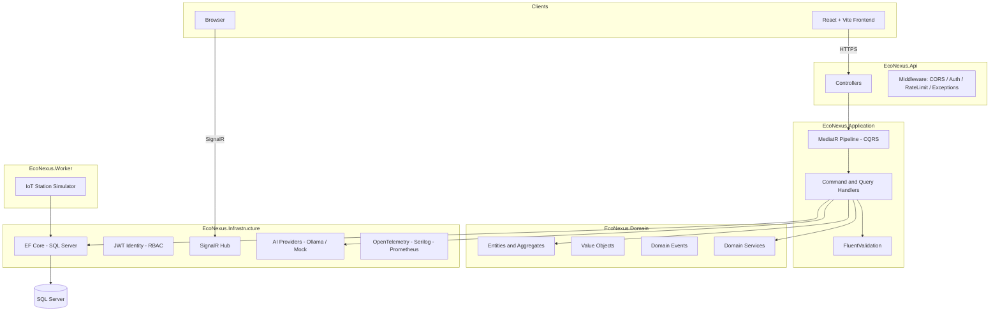

# EcoNexus AI

> **AI-Powered Smart Waste & Recycling Network** — a cloud-native platform that connects IoT-instrumented waste stations, predictive analytics, intelligent collection routing, citizen engagement, and recycling operations through an event-driven architecture.

[](https://github.com/yogiinarendranath-cell/EcoNexusAI/actions/workflows/ci.yml)
[](https://dotnet.microsoft.com)
[](#testing)
[](#license)

---

## Table of Contents

- [What It Does](#what-it-does)
- [Architecture](#architecture)
- [Tech Stack](#tech-stack)
- [Quickstart](#quickstart)
- [Project Structure](#project-structure)
- [Testing](#testing)
- [Observability](#observability)
- [API Surface](#api-surface)
- [Documentation](#documentation)
- [Roadmap](#roadmap)

---

## What It Does

EcoNexus AI is a full-stack waste-management platform for smart cities. It provides:

- **Smart Waste Stations** — IoT-instrumented bins that report fill levels in real time
- **AI Waste Classification** — Citizens upload a photo; the platform classifies the waste type and provides disposal guidance
- **Predictive Fill-Level Forecasting** — Forecasts when a station will overflow based on recent sensor readings
- **Route Optimization** — Prioritized collection routes based on urgency, distance, and vehicle capacity
- **Recycling Facility Workflow** — Intake recording, processing stage tracking, and sustainability metrics
- **Citizen Engagement** — Green points ledger, reward redemption, station visits, and report filing
- **AI Operations Assistant** — Natural-language queries against live operational data
- **Real-Time Dashboard** — SignalR pushes station fill-level changes to connected operators

---

## Architecture

EcoNexus AI follows **Clean Architecture** with strict dependency rules enforced by architecture tests.



### Dependency Rule (enforced by tests)

```
Domain          <- no dependencies (pure)
   ^
   |
Application     <- depends on Domain
   ^
   |
Infrastructure  <- depends on Application, Domain
   ^
   |
Api / Worker    <- composition roots
```

**Zero violations.** See `tests/EcoNexus.ArchitectureTests/DependencyRulesTests.cs`.

---

## Tech Stack

| Layer | Technology |
|---|---|
| Runtime | .NET 10, C# 14 |
| Web | ASP.NET Core, Controllers + Minimal APIs |
| CQRS | MediatR 12 |
| Validation | FluentValidation 12 |
| Data | EF Core 10, SQL Server |
| Identity | ASP.NET Core Identity, JWT Bearer, RBAC |
| Real-Time | SignalR |
| AI | Provider-agnostic (Ollama / Mock) |
| Observability | OpenTelemetry, Serilog, Prometheus |
| Frontend | React 19, Vite 8, TypeScript 6, Zustand, TanStack Query, Tailwind 4 |
| Testing | xUnit, NSubstitute, NetArchTest, WebApplicationFactory, coverlet |
| Dev Environment | Docker Compose (SQL Server + Azurite + API + Worker) |
| Package Management | Directory.Packages.props (central versioning) |

---

## Quickstart

### Prerequisites

- [.NET 10 SDK](https://dotnet.microsoft.com/download)
- [Docker Desktop](https://www.docker.com/products/docker-desktop) (for SQL Server + Azurite)
- [Node.js 20+](https://nodejs.org/)

### 1. Clone and restore

```bash
git clone https://github.com/yogiinarendranath-cell/EcoNexusAI.git
cd EcoNexusAI
dotnet restore
```

### 2. Start backing services

```bash
docker compose up -d
```

Starts SQL Server on `localhost:1433` and Azurite (Azure Storage emulator) on `localhost:10000-10002`.

### 3. Apply migrations

```bash
dotnet ef database update --project src/EcoNexus.Infrastructure --startup-project src/EcoNexus.Api
```

### 4. Run the API

```bash
dotnet run --project src/EcoNexus.Api
```

- API: `https://localhost:7001`
- Swagger UI: `https://localhost:7001/swagger`
- Health: `https://localhost:7001/health/live`
- Metrics: `https://localhost:7001/metrics`

### 5. Run the IoT simulator (separate terminal)

```bash
dotnet run --project src/EcoNexus.Worker
```

### 6. Run the frontend (separate terminal)

```bash
cd web
npm install
npm run dev
```

Frontend at `http://localhost:5173`.

---

## Project Structure

```
EcoNexusAI/
├── src/
│   ├── EcoNexus.Api/            HTTP layer, controllers, middleware, composition root
│   ├── EcoNexus.Application/    CQRS features, MediatR handlers, validators
│   ├── EcoNexus.Contracts/      DTOs shared with clients
│   ├── EcoNexus.Domain/         Entities, value objects, events, domain services
│   ├── EcoNexus.Infrastructure/ EF Core, Identity, SignalR, AI providers, observability
│   └── EcoNexus.Worker/         IoT simulator + background workers
├── tests/
│   ├── EcoNexus.ArchitectureTests/  Dependency rule enforcement (NetArchTest)
│   ├── EcoNexus.IntegrationTests/   End-to-end HTTP tests (WebApplicationFactory)
│   └── EcoNexus.UnitTests/          Domain + application unit tests
├── web/                         React + Vite + TypeScript frontend
├── docs/                        PRD, ADRs, architecture, changelog, backlog
├── docker/                      Dockerfiles for API and Worker
├── docker-compose.yml           Local dev stack
├── Directory.Build.props        Shared MSBuild settings
└── Directory.Packages.props     Central NuGet version management
```

---

## Testing

**232 tests, all green:**

| Project | Count | Scope |
|---|---|---|
| EcoNexus.ArchitectureTests | 8 | Layer dependencies, project refs |
| EcoNexus.UnitTests | 179 | Domain aggregates, value objects, handlers, services |
| EcoNexus.IntegrationTests | 45 | HTTP endpoints, auth flows, real-time, caching, rate limiting |

Run all tests:

```bash
dotnet test
```

Run with coverage:

```bash
dotnet test tests/EcoNexus.UnitTests --collect:"XPlat Code Coverage"
```

Coverage output is a Cobertura XML under `tests/EcoNexus.UnitTests/TestResults/`.

**Architecture rules enforced in CI** — if you break the dependency direction, the build fails.

---

## Observability

- **Structured logging** — Serilog with trace-ID enrichment
- **Distributed tracing** — OpenTelemetry (HTTP, EF Core, outbound HTTP)
- **Metrics** — exposed at `/metrics` in Prometheus format
- **Custom business meters** — `econexus_station_reading_recorded`, etc.
- **Health checks** — `/health/live` (liveness), `/health/ready` (readiness)
- **Correlation** — every log line includes `trace:{TraceId} span:{SpanId}`

> **Production note:** The `/metrics` endpoint must be firewalled to internal traffic only — see `Program.cs`.

---

## API Surface

Versioned via route prefix (`/api/v1/...`):

| Area | Endpoints |
|---|---|
| Auth | `POST /register`, `POST /login`, `POST /refresh`, `POST /logout`, `GET /me` |
| Stations | `GET`, `GET /{id}`, `POST`, `PUT /{id}`, `DELETE /{id}`, `POST /{id}/readings` |
| Collection Jobs | `GET`, `GET /{id}`, `POST /preview-route`, `POST` |
| Collection Vehicles | `GET`, `POST` |
| Recycling Facilities | `GET`, `GET /{id}`, `POST`, `POST /{id}/intakes`, `POST /{id}/intakes/{intakeId}/advance` |
| Citizen | `GET /profile`, `GET /points/history`, `POST /visits`, `GET /rewards`, `POST /rewards/{id}/redeem`, `POST /reports`, `GET /reports/mine`, `POST /classify`, `GET /classifications` |
| Operations Assistant | `POST /ask` (RBAC: SuperAdmin, CityAdmin, OperationsManager) |
| System | `GET /api/v1/ping`, `GET /health/live`, `GET /health/ready`, `GET /metrics` |
| Real-Time | SignalR hub at `/hubs/operations` |

Full OpenAPI spec at `/swagger` when running locally.

---

## Documentation

- [Product Requirements Document](docs/PRD.md)
- [Architecture Overview](docs/architecture/overview.md)
- [Architecture Decision Records](docs/adr/)
- [Changelog](docs/CHANGELOG.md)
- [Backlog](docs/backlog.md)

---

## Roadmap

**Done:**
- Clean Architecture + CQRS foundation
- Identity (JWT + refresh tokens + RBAC)
- Waste Stations, Collection Jobs, Vehicles, Recycling Facilities
- AI Waste Classification (provider-agnostic)
- AI Operations Assistant (8 tools)
- Route Optimization
- Citizen app (web)
- Real-time updates (SignalR)
- IoT Station Simulator
- Observability (OpenTelemetry + Serilog + Prometheus)

**In Progress:**
- Predictive Fill-Level Forecasting
- CI/CD pipeline + Azure deployment
- Application-layer unit-test coverage expansion

**Planned:**
- Notification service (email/SMS)
- Mobile app
- Multi-tenant support

See [docs/backlog.md](docs/backlog.md) for the current prioritized queue.

---

## Author

**Narendra N** — [@yogiinarendranath-cell](https://github.com/yogiinarendranath-cell)

Built as a portfolio project demonstrating production-grade .NET architecture.