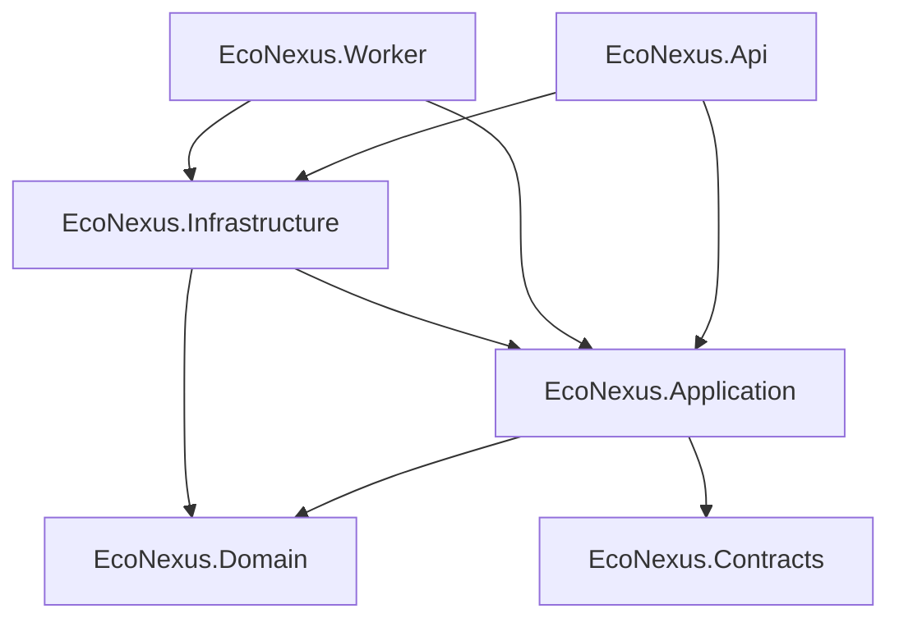
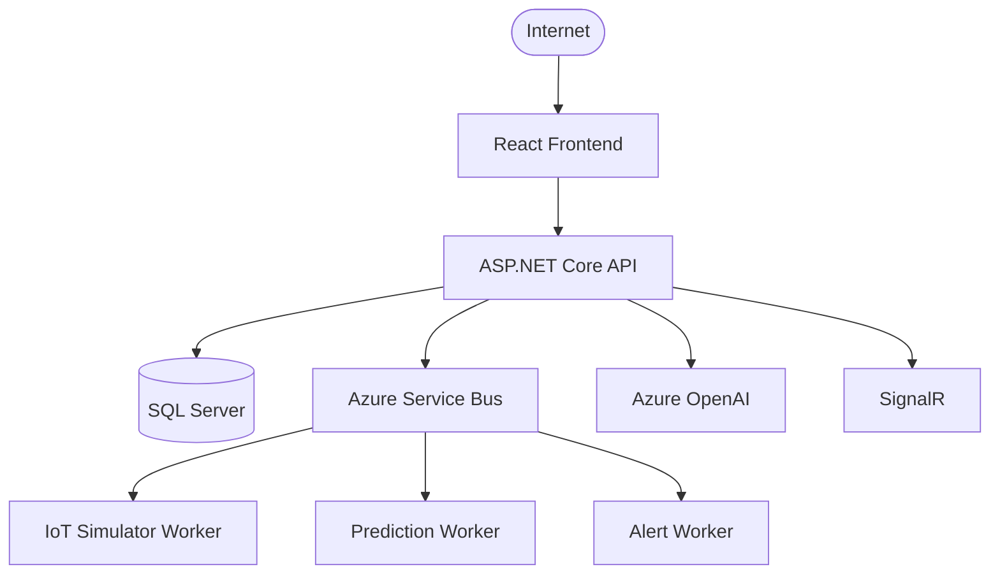

# EcoNexus AI — Architecture Overview

## Layered Architecture

## Dependency Rules

- `Domain` and `Contracts` depend on nothing.
- `Application` depends on `Domain` + `Contracts`.
- `Infrastructure` depends on `Application` + `Domain`.
- `Api` and `Worker` depend on `Application` + `Infrastructure` (+ `Contracts` for `Api`).

## Decisions

See `docs/adr/` for the list of architectural decisions.

## Target Production Architecture

